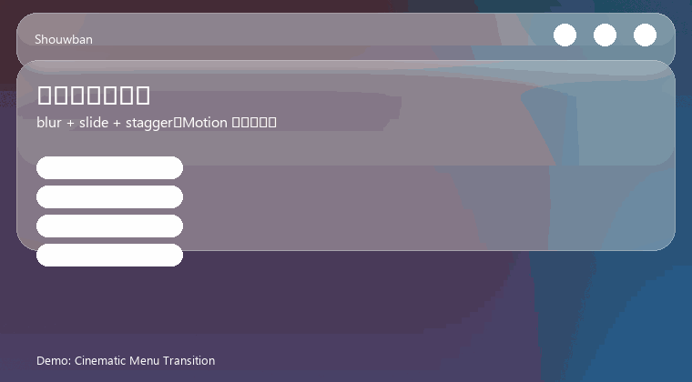
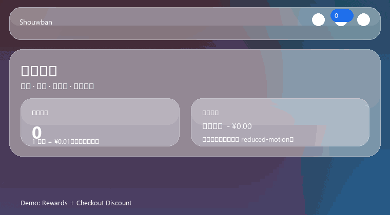
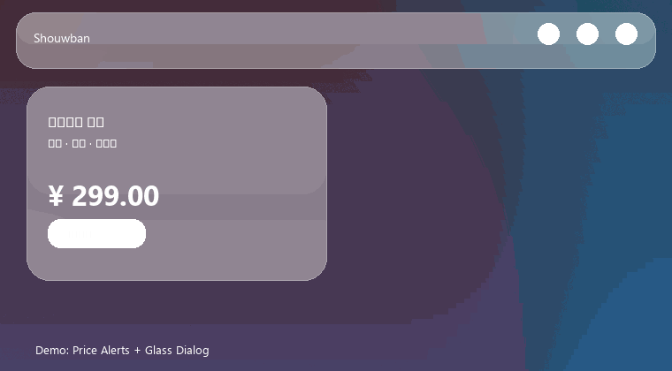
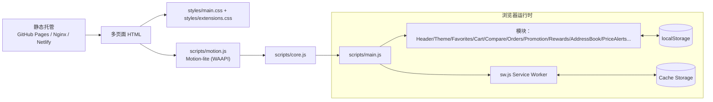
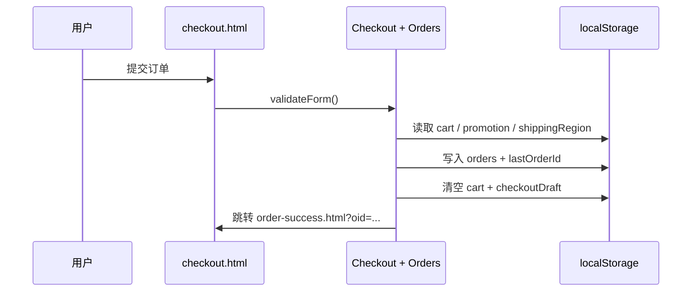

# 塑梦潮玩（Shouwban）

[](https://github.com/TUR1412/Shouwban/actions/workflows/validate.yml)
[](https://tur1412.github.io/Shouwban/)
[](https://github.com/TUR1412/Shouwban/commits/master)
[](https://github.com/TUR1412/Shouwban)

一个「纯静态、无后端依赖」的手办电商多页面模板（PWA Ready）：开箱即用，可直接部署到 GitHub Pages / Nginx / Netlify / Vercel 等任意静态托管。

<p align="center">
  
</p>

## 目录

- [预览](#预览)
- [动态演示](#动态演示)
- [架构概览（含图）](#架构概览含图)
- [快速开始](#快速开始)
- [核心能力](#核心能力)
- [页面与路由](#页面与路由)
- [目录结构（核心）](#目录结构核心)
- [本地预览（推荐）](#本地预览推荐)
- [原子级自检（推荐）](#原子级自检推荐)
- [极限构建（Vite）](#极限构建vite)
- [缓存版本号（重要）](#缓存版本号重要)
- [部署指南（详尽）](#部署指南详尽)
- [二次开发（最常见）](#二次开发最常见)
- [安全](#安全)
- [未来进化蓝图](#未来进化蓝图)

## 预览

- GitHub Pages：`https://tur1412.github.io/Shouwban/`
- 本地预览：见下方「本地预览（推荐）」

## 动态演示

> 以下为“功能+审美”演示动图（示意），用于 README 快速理解交互节奏；真实效果以页面运行为准。

<p align="center">
  
</p>

<p align="center">
  
</p>

<p align="center">
  
</p>

## 架构概览（含图）

> 本项目为静态站点：所有交互（收藏/购物车/对比/优惠码/订单）均在浏览器侧完成，数据持久化在 `localStorage`。

### 1) 组件关系图（高层）



### 2) 下单（模拟）数据流（序列）



## 快速开始

> 本仓库保持 **运行时零依赖**。`npm run verify` / `npm run bump:version` 不要求安装依赖；若使用 Vite 的 `dev/build/preview`，请先执行 `npm install`。

### 1) 运行原子级自检

```powershell
pwsh -NoLogo -Command "npm run verify"
```

### 2) 启动本地静态预览

```powershell
pwsh -NoLogo -Command "python -m http.server 5173"
```

访问：`http://localhost:5173/index.html`

## 核心能力

- 2025 Quark UI 体系：Bento Grid + 玻璃拟态 + 极光背景 + 影院级分层（兼顾 WCAG AA 可读性）
- 零运行时 CDN 依赖：图标使用本地 SVG Sprite（`assets/icons.svg`），字体使用系统字体栈（更快、更稳、更隐私）
- 影院级微交互（新增）：基于浏览器原生 WAAPI 的 Motion-lite 动效层（`scripts/motion.js`），渐进增强且自动尊重 `prefers-reduced-motion`
- 命令面板（新增）：`Ctrl/Cmd + K` 快速跳转/搜索/复制链接/切换主题（无第三方依赖）
- 虚拟滚动引擎（新增）：零依赖 VirtualScroll，支持超长列表性能压测（`products.html?stress=100000`）
- 系统健康全景图（新增）：控制台诊断工具 `window.ShouwbanDiagnostics`（FPS/LongTask/内存趋势，亦可 `?health=1` 自动监控）
- 多页面电商流程：列表/分类/详情/购物车/结算/收藏/静态内容
- 商品对比（新增）：最多对比 3 件商品，支持从列表/详情加入、对比页移除与加购（`compare.html`）
- 订单中心（新增）：模拟下单 → 生成订单 → 订单成功页 → 订单中心查看、复制订单号、再次购买（`orders.html` / `order-success.html`）
- 优惠码（新增）：支持 `SHOUWBAN10` / `NEW50` / `FREESHIP`（本地逻辑示例，购物车与结算同步）
- 运费估算（新增）：基于配送地区与阈值规则，实时计算运费（本地逻辑示例）
- 会员中心（新增）：积分/权益、常用地址簿、降价提醒中心（`account.html`）
- 积分体系（新增）：下单返积分、结算可用积分抵扣（本地规则示例）
- 常用地址簿（新增）：结算页一键选择常用地址/保存地址（减少填写摩擦）
- 降价提醒（新增）：列表/详情一键设置目标价，达到时本地提示（示例逻辑）
- 本地数据备份/迁移（新增）：会员中心「数据管理」支持导出/导入/清空本地数据（JSON 备份）
- 搜索联想：顶部搜索即输即提示，支持键盘选择直达详情
- 最近浏览：首页自动复盘最近查看的商品（`recentlyViewed`）
- 本地数据闭环：购物车/收藏/对比/订单/结算草稿即时写入 `localStorage`，刷新不丢，多标签页自动同步
- PWA：Service Worker 离线兜底 + Manifest 快捷入口 + 安装引导按钮（仅 https/localhost 生效）
- SEO 基础：`robots.txt` + `sitemap.xml` + OG/Twitter meta + Product JSON-LD（详情页）
- 工程化防线：CI 自动执行 `node --check` + `node scripts/validate.mjs`（零依赖）

> 说明：本项目不包含真实支付/真实订单履约/真实库存同步等后端能力；结算与订单为前端模拟流程，适合作为原型或后续对接真实 API 的模板。

## 页面与路由

| 页面 | 文件 | 路由/参数 |
| --- | --- | --- |
| 首页 | `index.html` | `/index.html` |
| 商品列表 | `products.html` | `/products.html` |
| 分类页 | `category.html` | `/category.html?cat=...` |
| 商品详情 | `product-detail.html` | `/product-detail.html?id=...` |
| 购物车 | `cart.html` | `/cart.html` |
| 结算（模拟） | `checkout.html` | `/checkout.html` |
| 订单成功（模拟） | `order-success.html` | `/order-success.html?oid=...` |
| 订单中心（本地） | `orders.html` | `/orders.html` |
| 商品对比（本地） | `compare.html` | `/compare.html` |
| 收藏夹 | `favorites.html` | `/favorites.html` |
| 会员中心（本地） | `account.html` | `/account.html` |
| 静态内容 | `static-page.html` | `/static-page.html?page=faq\|privacy\|tos` |
| 离线页 | `offline.html` | PWA fallback |
| 404 | `404.html` | 静态托管兜底页 |

## 目录结构（核心）

- `styles/main.css`：主样式
- `styles/extensions.css`：扩展样式（主题/收藏/对比/订单/优惠码等，覆盖式加载，便于独立维护）
- `scripts/motion.js`：Motion-lite 动效适配层（基于 WAAPI；渐进增强）
- `scripts/core.js`：纯函数与通用工具（可 100% 覆盖率单测）
- `scripts/main.js`：核心逻辑（数据 + 渲染 + 交互）
- `account.html`：会员中心（积分/地址簿/降价提醒）
- `scripts/validate.mjs`：零依赖校验脚本
- `scripts/bump-version.mjs`：统一 bump 版本号脚本（缓存穿透）
- `vite.config.mjs`：Vite 构建配置（可选，用于生成 `dist/` 极限压缩产物）
- `scripts/build-ultra.mjs`：一键极限构建（Vite build + 静态资源补齐 + 预压缩）
- `scripts/compress-dist.mjs`：为 `dist/` 生成 brotli/gzip 预压缩文件
- `scripts/postbuild-copy.mjs`：补齐运行时字符串引用的静态资源到 `dist/`
- `sw.js`：Service Worker（PWA 缓存策略）
- `assets/`：图片 / favicon / manifest 等静态资源
- `assets/icons.svg`：本地 SVG Sprite 图标库（替代外部 Icon CDN）

## 本地预览（推荐）

由于浏览器安全策略，直接双击打开 `html` 文件可能会导致部分资源或跳转行为异常（尤其是 PWA/Service Worker）。建议使用本地静态服务器预览。

### 方式 A：Python（无需额外依赖）

```powershell
pwsh -NoLogo -Command "python -m http.server 5173"
```

然后访问：`http://localhost:5173/index.html`

### 方式 B：Node.js（可选）

```powershell
pwsh -NoLogo -Command "npx --yes http-server . -p 5173 -c-1"
```

### 方式 C：Vite（推荐用于二次开发/极限构建）

> 仅在你需要使用 `npm run dev` / `npm run build` 时才需要安装 devDependencies。

```powershell
pwsh -NoLogo -Command "npm install"
pwsh -NoLogo -Command "npm run dev"
```

## 原子级自检（推荐）

该仓库提供一个零依赖校验脚本，用于检查：

- 全部页面是否带缓存版本号（避免“改了没生效”）
- 版本号是否统一（HTML 与 `sw.js` 必须一致，避免“更新了但缓存没更新”）
- HTML/CSS 引用的本地资源是否存在（避免缺图/404）
- 是否注入主题脚本、是否包含扩展样式（保证主题/收藏/对比/订单等能力完整）
- `robots.txt` / `sitemap.xml` / `sw.js` / `offline.html` 等关键文件是否齐全
- `styles/main.css` 是否存在误拼接重复段（防止样式体积异常增长）
- 构建产物目录（`dist/` 等）是否被忽略（避免构建后自检误报）
- 运行时脚本是否使用 `type="module"`（确保可选 Vite 构建链路可用）

执行：

```powershell
pwsh -NoLogo -Command "node scripts/validate.mjs"
```

或：

```powershell
pwsh -NoLogo -Command "npm run verify"
```

## 极限构建（Vite）

当你希望获得更小的 **生产部署产物**（打包/压缩/预压缩一体化）时，可使用本仓库提供的可选构建链路：

### 1) 安装 devDependencies（仅首次）

```powershell
pwsh -NoLogo -Command "npm install"
```

### 2) 一键极限构建（推荐）

```powershell
pwsh -NoLogo -Command "npm run build"
```

输出目录：`dist/`（已加入 `.gitignore`，不会被提交）。

该命令会：
- 运行 `vite build`（多页面打包 + esbuild 压缩）
- 将运行时“字符串路径引用”的静态资源补齐到 `dist/`（如 `assets/icons.svg`、`assets/images/*`、`robots.txt`、`sitemap.xml`）
- 生成 `.br` / `.gz` 预压缩文件（便于支持预压缩的静态托管直接启用）

### 3) 预览构建产物

```powershell
pwsh -NoLogo -Command "npm run preview"
```

> 说明：源站直接静态部署（仓库根目录）仍是默认推荐方式（含 PWA/Service Worker）。`dist/` 更偏向“体积/传输效率优先”的构建产物，默认不保证与源站 SW 预缓存策略完全一致。

## 缓存版本号（重要）

静态站点常见“改了没生效”，通常是浏览器缓存或 Service Worker 缓存导致。为此本项目强制：

- 所有 HTML 引用都带版本号：`styles/main.css?v=...`、`styles/extensions.css?v=...`、`scripts/motion.js?v=...`、`scripts/core.js?v=...`、`scripts/main.js?v=...`
- `sw.js` 内也包含同一版本号（`CACHE_NAME` + `PRECACHE_URLS`）
- 修改核心逻辑 / 样式 / PWA 缓存策略后，请同步 bump 版本号

### 一键 bump 版本号（推荐）

```powershell
pwsh -NoLogo -Command "node scripts/bump-version.mjs 20251224.2"
```

或：

```powershell
pwsh -NoLogo -Command "npm run bump:version -- 20251224.2"
```

运行后建议执行：`npm run verify` 确认一致性。

## 部署指南（详尽）

### 方案 A：GitHub Pages（推荐）

1. 进入仓库：`Settings` → `Pages`
2. `Build and deployment` → `Source` 选择 `Deploy from a branch`
3. `Branch` 选择 `master`，`Folder` 选择 `/ (root)`
4. 保存后等待部署完成（Actions/Pages 会提示部署状态）

### 方案 B：Netlify（拖拽/或 Git）

- Build command：留空
- Publish directory：`/`（仓库根目录）
- Deploy 即可

### 方案 C：Vercel（静态站点）

- Framework Preset：`Other`
- Build command：留空
- Output directory：`/`（仓库根目录）

### 方案 D：Nginx（自托管）

1. 将仓库根目录内容放入站点目录（例如 `/var/www/shouwban`）
2. 配置 Nginx：

```nginx
server {
  listen 80;
  server_name example.com;

  root /var/www/shouwban;
  index index.html;

  location / {
    try_files $uri $uri/ =404;
  }
}
```

## 二次开发（最常见）

- 品牌名/文案：直接编辑各页面顶部 Logo 与标题区域文案
- 商品数据：在 `scripts/main.js` 的 `SharedData` 内调整（后续可替换为后端 API）
- 图片资源：将真实图片放入 `assets/images/`，并在 `SharedData` 中替换对应路径
- 新功能扩展：优先在 `styles/extensions.css` 与 `scripts/main.js` 新增模块，避免破坏主样式结构

## 安全

安全边界与漏洞披露方式：见 `SECURITY.md`。

## 故障排查

常见问题（缓存 / SW / `file://` 限制）：见 `TROUBLESHOOTING.md`。

## 贡献

贡献指南：见 `CONTRIBUTING.md`。

## 未来进化蓝图

> 以下为“可验证、可落地”的演进路线，默认保持 **运行时零第三方依赖** 与 **可直接静态部署** 的基因；如要接入真实业务，可在不破坏模板体验的前提下渐进升级。

### Version 2026.1（模块化 Runtime 2.0）

目标：在不引入框架的前提下，把 `scripts/main.js` 从“单文件多模块”推进到“可组合模块”，提升可维护性与可测试性。

- 模块拆分：将 Favorites/Cart/Compare/Orders/Rewards 等拆分为独立文件（仍保持 IIFE/显式 init），并定义清晰的依赖顺序
- 类型化（轻量）：为关键数据结构补齐 JSDoc 类型（订单/商品/地址/优惠），提升 IDE 体验与可读性
- 测试扩容：为 `scripts/main.js` 的纯逻辑部分提取到 `scripts/core.js` 并补齐单测（继续保持 100% 覆盖率策略）

### Version 2026.2（PWA 2.0：离线与数据层升级）

目标：把“离线可用”从“页面级缓存”升级到“数据级离线”，让购物车/订单/收藏体验更接近真实商业应用。

- 存储升级：对购物车/订单/降价提醒等高频数据引入 IndexedDB（保留 localStorage 作为兼容 fallback）
- 离线策略升级：为静态资源与关键数据引入更精细的缓存分层（如 stale-while-revalidate + 数据回放）
- 通知能力：可选接入 Web Push（降价提醒、订单状态提醒），并提供“纯前端模拟模式”保持模板可运行

### Version 2026.3（Headless/真实业务接入）

目标：提供“从模板到真实电商”的最小迁移路径，把本地模拟逻辑逐步替换为真实 API，同时保持 UI/交互资产可复用。

- API 适配层：定义 `api/` 抽象（Products/Orders/Auth），支持切换到任意后端（Serverless/自建）
- 安全与合规：CSP、安全响应头、鉴权流程、隐私合规与审计日志（按目标地区法规落地）
- 端到端测试：引入 Playwright（仅开发期）覆盖核心交易链路：浏览 → 加购 → 结算 → 下单 → 订单中心
