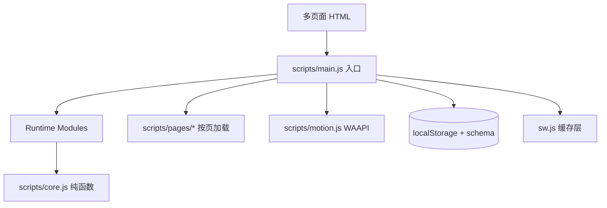

# 技术设计: Quark Overhaul 夸克级重构与业务进化

## 技术方案
### 核心技术
- HTML5 / CSS3 / JavaScript（ES6+）
- WAAPI 动效（保持 `prefers-reduced-motion` 兼容）
- localStorage（协议前缀 + schema 迁移）
- PWA Service Worker（预缓存 + 版本化）

### 实现要点
- 运行时模块化：保持 `scripts/main.js` 入口不变，将业务模块拆分为可组合单元并在入口聚合。
- 数据迁移层：在读写 localStorage 时引入 schema version 与兼容迁移逻辑。
- 业务扩展统一协议：库存/套装/会员/订单/关注/推荐统一为可配置规则，避免硬编码。
- UI 重塑：新增视觉 token 与组件样式层，复用现有 HTML 结构并按需调整语义结构。
- 性能迭代：缓存热点计算、减少 DOM 重排、合并事件监听、按需加载与惰性渲染。

## 架构设计


## 架构决策 ADR
### ADR-002: 运行时模块化但保持零依赖
**上下文:** `scripts/main.js` 规模已达高复杂度，继续堆叠将降低可维护性。
**决策:** 引入运行时模块拆分，但不引入任何运行时框架或外部依赖。
**理由:** 保持零依赖与直接静态部署优势，同时提升可维护性。
**替代方案:** 引入前端框架 → 拒绝原因: 破坏零依赖与部署简单性。
**影响:** 需要同步更新 PWA 预缓存与校验脚本，页面模块导入路径保持一致。

### ADR-003: 引入 localStorage schema 迁移层
**上下文:** 新业务能力新增多类数据结构，直接写入可能破坏历史数据。
**决策:** 统一在 Storage 读写中引入 schema 版本与迁移函数。
**理由:** 保证向前兼容与可回滚。
**替代方案:** 强制清空本地数据 → 拒绝原因: 破坏用户体验与数据连续性。
**影响:** 需要补齐迁移测试与校验。

## API设计
无外部 API 变更（纯静态站点）。

## 数据模型
```text
sbSchemaVersion: number
sbInventory: { [productId]: { stock: number, preorder: boolean, eta?: string } }
sbBundles: { id, items: string[], discountType, discountValue }
sbMembership: { tier: string, points: number, updatedAt: string }
sbOrderTimeline: { [orderId]: { status: string, timeline: { status, ts }[] } }
sbWatchCenter: { favorites: string[], priceAlerts: [], restockAlerts: [] }
sbPriceHistory: { [productId]: { ts, price }[] }
```

## 安全与性能
- **安全:** 输入校验、localStorage 白名单、XSS 过滤/escape、严禁外部 CDN。
- **性能:** 减少同步布局、复用 DOM、压缩长任务、优化列表渲染与动效节流。

## 测试与部署
- **测试:** `npm run verify`、`npm test`，关键业务场景手测（结算/订单/收藏/对比）。
- **部署:** 标准 Git 提交流程；版本号一致性通过 `scripts/bump-version.mjs` 保证。
