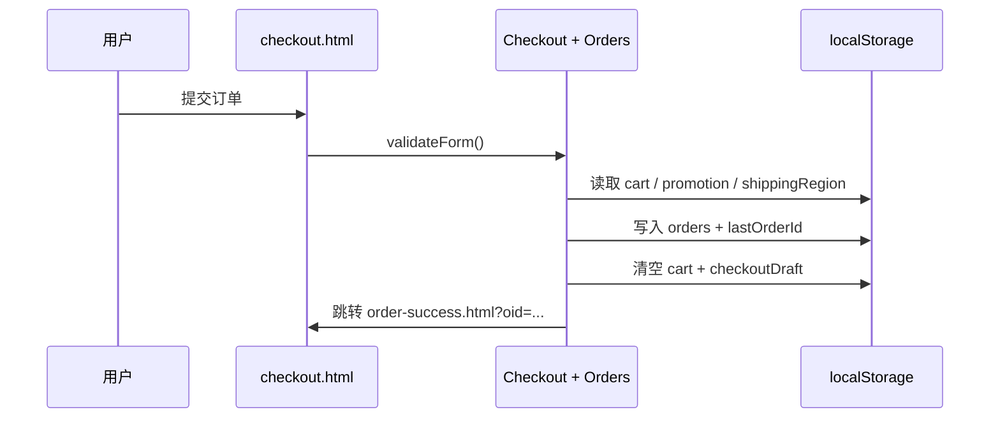

# 架构设计

## 总体架构

```mermaid
flowchart TD
  Host[静态托管<br/>GitHub Pages / Nginx / Netlify] --> HTML[多页面 HTML]
  HTML --> CSS[styles/main.css + styles/extensions.css]
  HTML --> Icons[assets/icons.svg<br/>本地 SVG Sprite]
  HTML --> Motion[scripts/motion.js<br/>Motion-lite (WAAPI)]
  HTML --> Core[scripts/core.js<br/>纯函数/可测试]
  HTML --> Main[scripts/main.js<br/>交互/模块/渲染]

  subgraph Browser[浏览器运行时]
    Main --> LS[(localStorage)]
    Main --> SW[sw.js Service Worker]
    SW <--> Cache[(Cache Storage)]
  end
```

## 技术栈
- **前端**：HTML5 / CSS3 / JavaScript（ES6+）
- **动效**：WAAPI（Web Animations API），并尊重 `prefers-reduced-motion`
- **图标**：本地 SVG Sprite（`assets/icons.svg`）
- **PWA**：Service Worker + manifest + offline fallback

## 核心流程示例：购物车 → 结算（模拟）



## 重大架构决策

| adr_id | title | date | status | affected_modules | details |
|--------|-------|------|--------|------------------|---------|
| ADR-001 | 移除运行时 CDN，改用本地图标 + 系统字体 | 2025-12-24 | ✅已采纳 | UI / Runtime JS / PWA | `../history/2025-12/202512241900_singularity-refactor/how.md#adr-001` |

